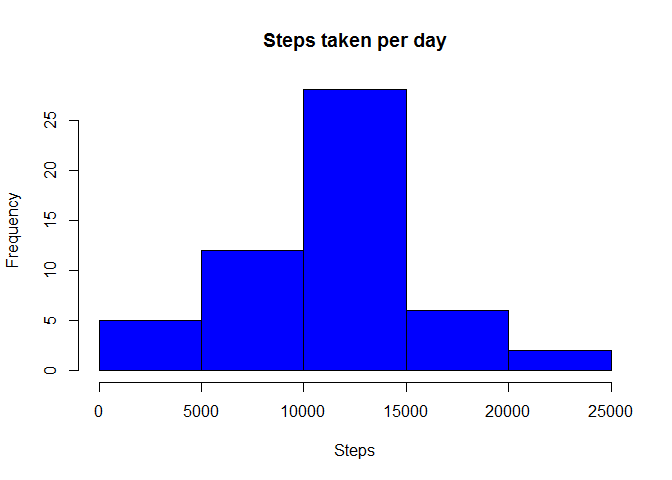
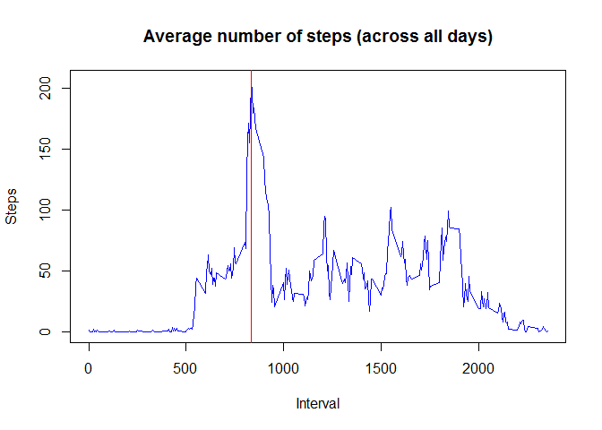
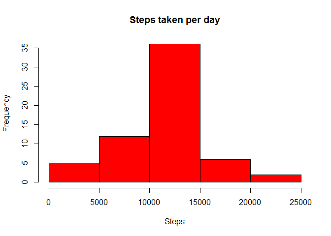
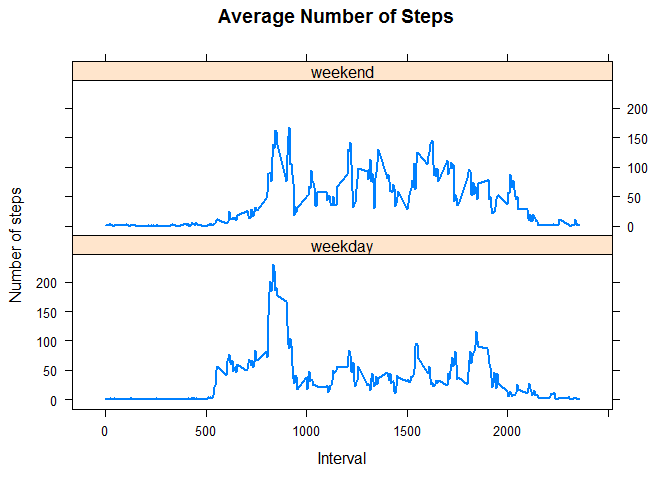

# Reproducible Research: Peer Assessment 1


## Loading and preprocessing the data


```r
Sys.setlocale("LC_ALL", locale="English")
```

```
## [1] "LC_COLLATE=English_United States.1252;LC_CTYPE=English_United States.1252;LC_MONETARY=English_United States.1252;LC_NUMERIC=C;LC_TIME=English_United States.1252"
```

```r
library("ggplot2")
```

```
## Warning: package 'ggplot2' was built under R version 3.2.2
```

```r
library("plyr")
```

```
## Warning: package 'plyr' was built under R version 3.2.2
```

```r
df <- read.csv("activity.csv")
df$date <- as.Date(df$date, "%Y-%m-%d")
```


## What is mean total number of steps taken per day?

```r
steps_per_day <- aggregate(steps ~ date, data=df, sum)
colnames(steps_per_day) <- c("date", "steps")


mean_steps <- mean(steps_per_day$steps, na.rm=TRUE)
median_steps <- median(steps_per_day$steps, na.rm=TRUE)

hist(steps_per_day$steps, col="blue", main="Steps taken per day", xlab="Steps")
```

 

The mean total number of steps taken per day is 10766.19.


The median total number of steps taken per day is 10765.


## What is the average daily activity pattern?

```r
interval_per_day <- aggregate(steps ~ interval, data=df, mean, na.action=na.omit)
colnames(interval_per_day) <- c("interval", "mean_steps")

with(interval_per_day, plot(interval, mean_steps, type="l", col="blue", main="Average number of steps (across all days)", xlab="Interval", ylab="Steps"))
max_interval <- interval_per_day$interval[which.max(interval_per_day$mean_steps)]
abline(v=max_interval, col="red")
```

 

The 5-minute interval, on average across all the days in the dataset, that contains the maximum number of steps is 835.

## Imputing missing values

```r
# get all missing values
missing_values <- is.na(df$steps)
nb_missing <- sum(missing_values)

# get the indices of the entries which contain missing values
indices <- which(missing_values==TRUE)

# function to retrieve the mean step value for an interval
get_mean_value <- function(x) {
  i <- match(x, interval_per_day$interval)
  interval_per_day$mean_steps[i]
}

# create a new data frame which is a copy of df
# and replace the missing values by the mean value of the interval
df_copied <- data.frame(df)
df_copied[indices,1] <- get_mean_value(df_copied[indices,3])
names(df_copied) <- c("steps", "date", "interval")

# agregate steps by day
steps_per_day <- aggregate(steps ~ date, data=df_copied, sum)
colnames(steps_per_day) <- c("date", "steps")

# and copy the new mean and median
mean_steps <- mean(steps_per_day$steps)
median_steps <- median(steps_per_day$steps)

# plot an histogram with the new data
hist(steps_per_day$steps, col="red", main="Steps taken per day", xlab="Steps")
```

 

The total number of missing values in the dataset is 2304.

The missing values have been replaced by the mean values in the interval.

Now the mean total number of steps taken per day is 10766.19.

Now the median total number of steps taken per day is 10766.19.

Replacing the missing values has not changed significantly the mean and median values, since the missing values have been replaced by the mean.

However, replacing the missing values has changed the estimate for the total daily number of steps, on those dates which were previously without data. 
These dates did not have steps in the past since the missing values were ignored, and now they have a value which is equal to the mean.


## Are there differences in activity patterns between weekdays and weekends?

```r
# function to convert from date to factor (weekday or weekend)
convert_weekday <- function(x) {
  ifelse(x=="Sunday", "weekend", ifelse(x=="Saturday", "weekend", "weekday"))
}

# create a vector with the factor values
wds <- convert_weekday(weekdays(df_copied$date))

# create a factor to represent the type of the day
df_copied$week <- factor(wds)

# Plot graphs of intervals x number of steps for weekdays and weekends
# aggreate number of steps per interval and per week
df_copied <- aggregate(steps ~ interval + week, data=df_copied, mean)

library(lattice)
```

```
## Warning: package 'lattice' was built under R version 3.2.1
```

```r
xyplot(steps ~ interval | week, data = df_copied, type = "l", lwd = 2,
       layout = c(1, 2), 
       xlab = "Interval", 
       ylab = "Number of steps",
       main = "Average Number of Steps")
```

 

